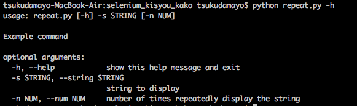
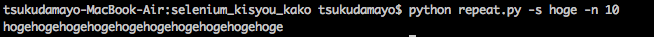

#pythonでコマンドラインオプションの引数の扱い方について

```python:repeat.py
import argparse

#パーサーのインスタンスを作成
parser = argparse.ArgumentParser(description='Example command')

#文字列を受け取る-sオプションを定義
parser.add_argument('-s', '--string', type=str, help='string to display', required=True)

#数値を受け取る-nオプションを定義
parser.add_argument('-n','--num',type=int, help='number of times repeatedly display the string', default=2 )

#引数をパースし、得られた値を変数に格納する
args = parser.parse_args()

#パースによって得られた値を扱う
print(args.string * args.num)  
```

- argparseには引数を定義することでコマンドのヘルプ表示を自動的に生成する機能があり、最小限のコードでも利用者に易しいコマンドラインツールを作成することができる
##コマンドラインオプションを扱う
- サンプルとしてrepeat.pyというスクリプトを作成
- 引数の１つに文字列、もう1つの引数に整数を受け取り、指定された数だけ繰り返し文字列を表示するだけのシンプルなスクリプト
- argparseモジュールを用いてコマンドラインオプションを定義し,渡された引数をパースし、パースされた値を用いて簡単な処理を行うサンプル
- サンプルコードではパーサを作成し、文字列を受け取る引数-sと、数値を受け取る引数-nという引数2つを定義した
- 受け取った引数は``parser.parse_args()``が実行されたタイミングでパースされ、正常にパースされるとその結果を返す
- サンプルコードの引数定義でパースが行われると、--stringや--numのような長いオプションと同じ名前で値が格納されるため、args.stringやargs.numとして値にアクセスできる
- 全体の挙動はパーサ初期化時の引数によって指定できる、ArgumtntParserに渡すことのできる引数は別途参照
###引数なしでrepeat.pyを実行すると
- 引数-sが必要であるというエラーが返る -> parse.argument()で引数を定義するときに、-sが必須であるということを``(required=True)``で指定しているから

###引数を-hでrepeat.pyを実行すると
- -hを指定してコマンドを実行すると、詳細なコマンドの使い方が表示される
- サンプルコードでは引数-hが指定されてはいないが、ArgumentParseはデフォルトの動作として引数の定義からヘルプを表示する引数-hを自動的に作成する

###パースに必要なオプションが渡された場合
- パースは正常に終了し、コードの末尾に記述されたデバッグ用のprintが動作している

##参考資料
- Pythonライブラリ厳選レシピ p112 (http://www.amazon.co.jp/Python-%E3%83%A9%E3%82%A4%E3%83%96%E3%83%A9%E3%83%AA%E5%8E%B3%E9%81%B8%E3%83%AC%E3%82%B7%E3%83%94-%E6%B1%A0%E5%86%85-%E5%AD%9D%E5%95%93/dp/4774177075)
